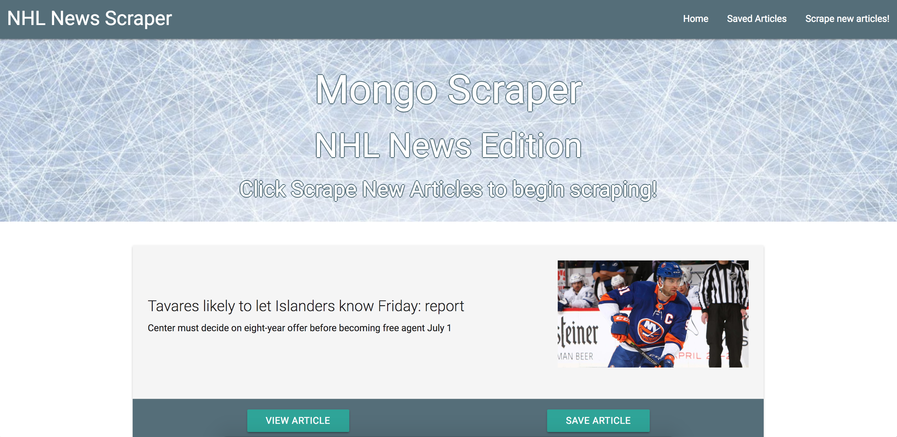
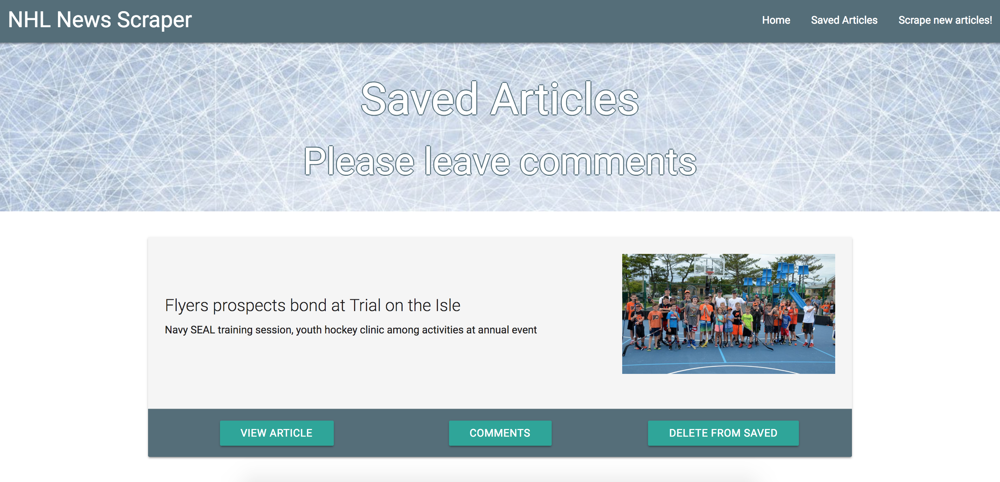
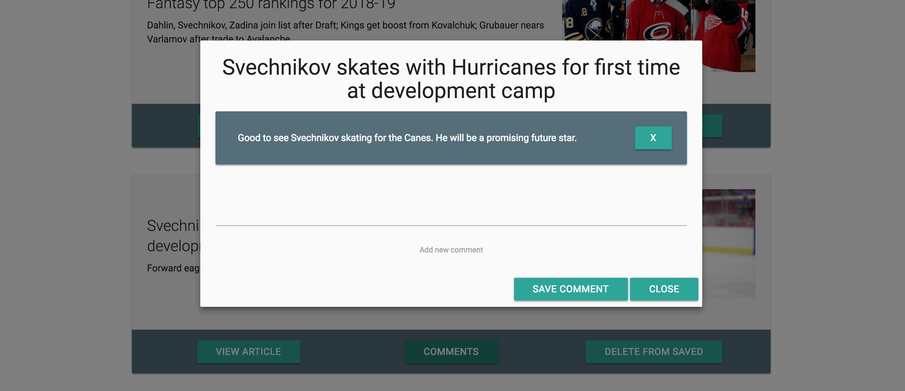

## nhl-scraper
A web app that lets users scrape, view, and leave comments on the latest NHL.com news articles.

Visit the deployed site [here](https://vast-bastion-74164.herokuapp.com/)

## Motivation
To create an app for hockey lovers everywhere to easily see and retrieve current NHL news. The app levarages MongoDB with Mongoose for data management and Cheerio to scrape data.
 
## Screenshots




## Tech/framework used
<b>Built with</b>
- [Node.js](https://nodejs.org/en/)
- [MongoDB](https://www.mongodb.com/)
- [Mongoose](http://mongoosejs.com/)
- [Express.js](https://www.npmjs.com/package/express)
- [Handlebars.js](https://www.npmjs.com/package/express-handlebars)
- [body-parser](https://www.npmjs.com/package/body-parser)
- [axios](https://www.npmjs.com/package/axios)
- [Materialize](http://materializecss.com/)
- [Cheerio](https://www.npmjs.com/package/cheerio)
- HTML5, CSS3, Javascript

## Features
Materialize provides for a polished UI, and Heroku's hosting combined with mongoLab provision allow for data persistence. Logic is in place to ensure there will not be any duplicate articles scraped. Straightforward, easy-to-follow web design with ability for users to comment and delete comments enhance the user experience.

## Installation
- Visit the deployed site at [NHL News Scraper](https://vast-bastion-74164.herokuapp.com/) for immediate use.
- Otherwise, fork and clone the GitHub repo to your machine.
- Ensure that you have Node.js and MongoDB installed on your machine
- Start MongoDB locally by opening a terminal and entering the ```mongod``` command. Leave this terminal window open in the background.
- In a new terminal, navigate to the cloned directory. Install the npm dependencies and start the server.
    ```npm install```
    ```node server.js```
- NHL News Scraper runs locally on port 3000. Open your favorite web browser and navigate to localhost:3000 to scrape away.
- NOTE: If https://www.nhl.com/news updates their dom elements, the scraping selectors may need to be updated to scrape properly.

## Credits
- NHL.com

